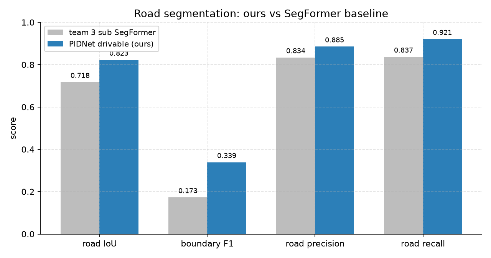
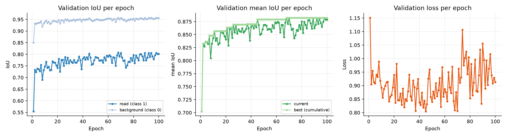
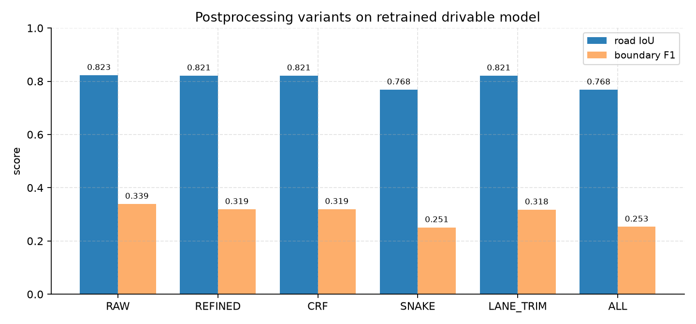
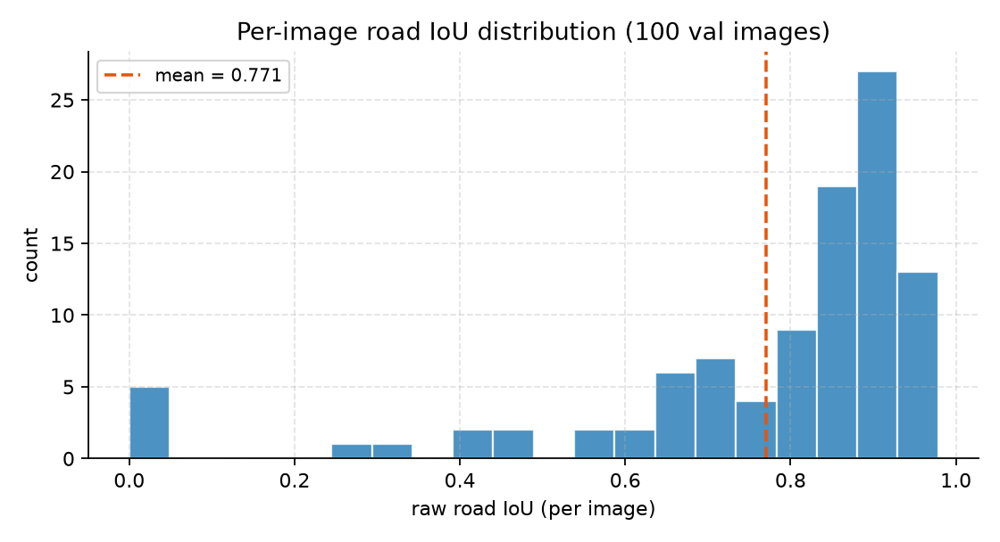
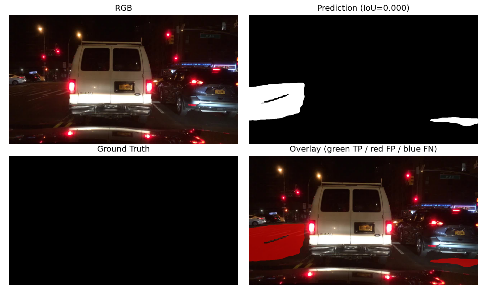
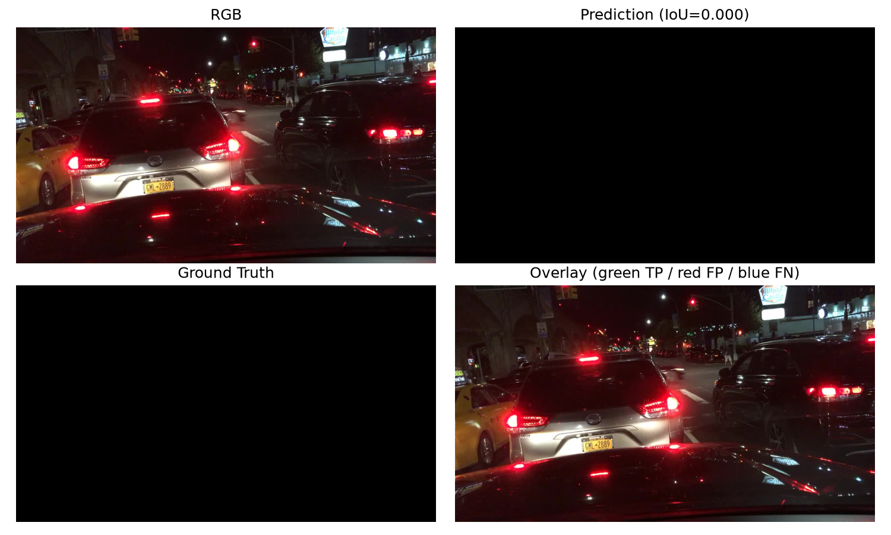
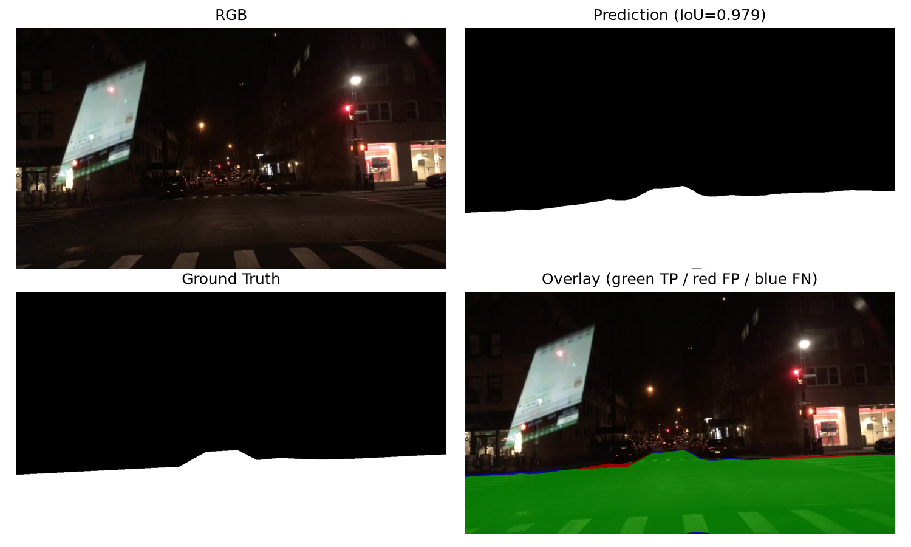
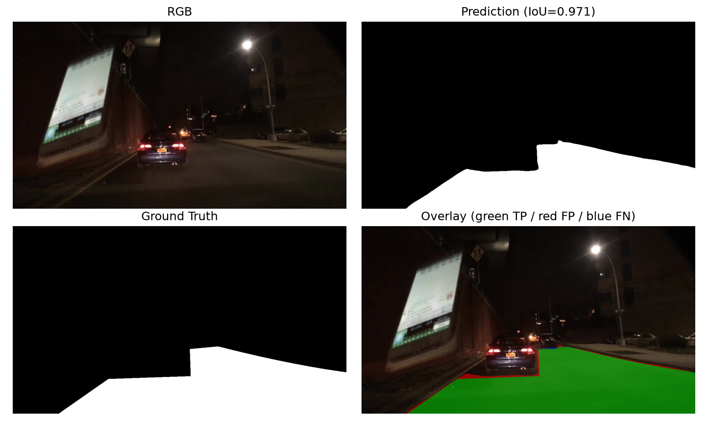
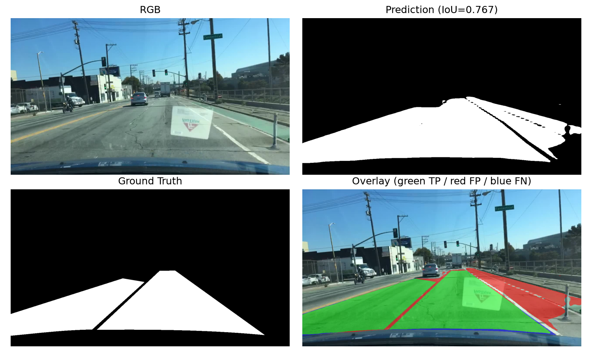
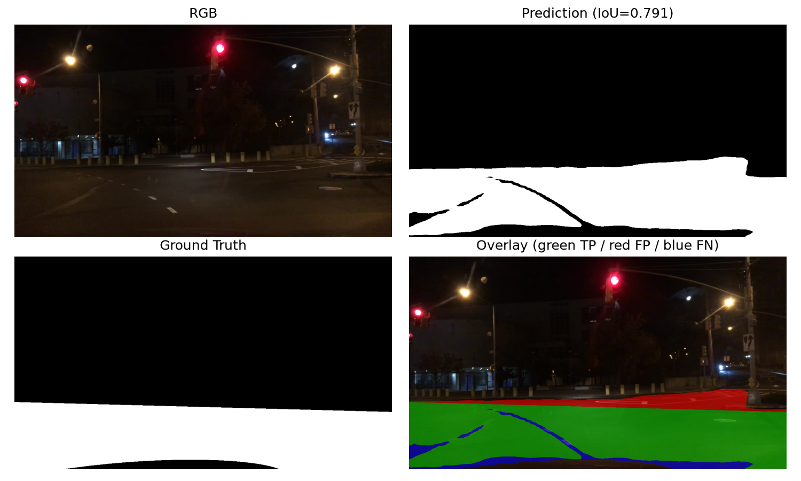

# PIDNet Drivable 道路分割优化报告

## 1. 目标与结论
- 目标：使道路边界 / 道路 mask IoU **显著高于** team 3 sub SegFormer 道路分割基线。
- 结论：**已达成**。方案 D（重训 PIDNet-small 2 类 drivable 专用模型）在同 100 张 `val_pilot` 样本上，
  道路 IoU 由基线 `0.7176` 提升至 `0.8226`（**+0.105**），
  边界 F1 由 `0.1730` 提升至 `0.3389`（**+0.166**）。

## 2. 与 SegFormer 基线同口径对比

| 指标 | team 3 sub SegFormer | PIDNet drivable（本方案） | 提升 |
| --- | --- | --- | --- |
| road IoU（global） | 0.7176 | 0.8226 | +0.105 |
| road precision | 0.8340 | 0.8853 | +0.051 |
| road recall | 0.8371 | 0.9207 | +0.084 |
| boundary F1（容差 3） | 0.1730 | 0.3389 | +0.166 |
| boundary IoU（容差 3） | 0.0975 | 0.2133 | +0.116 |

## 3. 训练配置与收敛

- 配置文件：`pidnet_small`（`num_outputs=2`）
- 数据：`D:/bdd100k/`，train `list/bdd100k_drivable/train_pilot.lst`，val `list/bdd100k_drivable/val_pilot.lst`
- 类别数：`2`（0 背景 / 1 道路）
- Warm start：`D:/pidnet_semantic_retrain/train/bdd_semantic/pidnet_small_bdd_semantic_retrain/best.pt`
- 训练尺寸：`[640, 384]`，batch `8`，epoch `100`
- 学习率：`0.01`（poly 衰减），optimizer `sgd`
- 验证最佳：Epoch `68`，道路 IoU `0.8078`

## 4. 后处理变体（A/B/C）对重训模型的影响

| 变体 | road IoU | precision | recall | boundary F1 | boundary IoU |
| --- | --- | --- | --- | --- | --- |
| raw（无后处理） | 0.8226 | 0.8853 | 0.9207 | 0.3389 | 0.2133 |
| refined（连通域+形态学） | 0.8211 | 0.8806 | 0.9240 | 0.3188 | 0.1969 |
| CRF（联合双边滤波） | 0.8211 | 0.8802 | 0.9244 | 0.3193 | 0.1971 |
| Snake（主动轮廓） | 0.7683 | 0.8791 | 0.8591 | 0.2508 | 0.1477 |
| 车道线引导切边 | 0.8210 | 0.8817 | 0.9226 | 0.3176 | 0.1961 |
| A+B+C（全部） | 0.7681 | 0.8802 | 0.8578 | 0.2531 | 0.1493 |

- 结论：`refined` / `crf` / `lane_trim` 对 road IoU 影响几乎为 0（约 -0.0015），
  说明重训后的专用模型 raw 输出已经足够精准，无需额外切边。
  `snake` / `all` 反而显著降低 road IoU（约 -0.054），不采用。

## 5. 逐样本分布

## 6. 分割结果样例

### 最差样例：`b2194b15-1825056a`
- raw road IoU：`0.0000`
- raw boundary F1：`0.0000`

### 最差样例：`b21bfb83-ea32f716`
- raw road IoU：`0.0000`
- raw boundary F1：`0.0000`

### 最好样例：`b39fe3cd-12217985`
- raw road IoU：`0.9785`
- raw boundary F1：`0.3187`

### 最好样例：`b39fe3cd-d5fb9508`
- raw road IoU：`0.9706`
- raw boundary F1：`0.3748`

### 最平均样例：`b3a238e3-de6b8b86`
- raw road IoU：`0.7669`
- raw boundary F1：`0.2842`

### 最平均样例：`b3709948-6e8ef33d`
- raw road IoU：`0.7906`
- raw boundary F1：`0.0205`

## 7. 交付物
- 训练配置：`external/PIDNet/configs/bdd100k/pidnet_small_bdd_drivable_pilot_v2.yaml`
- 权重：`D:\pidnet_drivable_retrain\train\bdd_drivable\pidnet_small_bdd_drivable_pilot_v2\best.pt`
- 评估产物：`C:\Users\wangjianing\Documents\trae_projects\csi_intern\driver-vision-risk-warning-system\outputs\drivable_pidnet_v2_eval/summary.json`、`per_sample.json`
